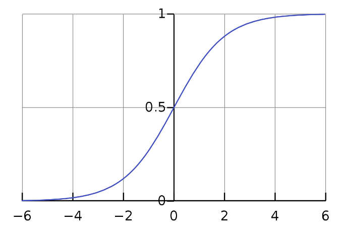

# Machine Learning

## Linear And Logistic Regression (Explained)

* **Linear Regression** is  **a machine learning algorithm based on supervised learning** . It performs a regression task. Regression models a target prediction value based on independent variables. It is mostly used for finding out the relationship between variables and forecasting.
* **Logistic Regression** is an example of supervised learning. It is  **used to calculate or predict the probability of a binary (yes/no) event occurring** . An example of logistic regression could be applying machine learning to determine if a person is likely to be infected with COVID-19 or not.

> EXPLAIN LINEAR REGRESSION

## Introduction

**Linear Regression is a commonly used supervised Machine Learning algorithm that predicts continuous values. Linear Regression assumes that there is a linear relationship present between dependent and independent variables. In simple words, it finds the best fitting line/plane that describes two or more variables.**

**On the other hand, Logistic Regression is another supervised Machine Learning algorithm that helps fundamentally in binary classification (separating discreet values).**

**Although the usage of Linear Regression and Logistic Regression algorithm is completely different, mathematically we can observe that with an additional step we can convert Linear Regression into Logistic Regression.**

I am going to discuss this topic in detail below.

## Steps of Linear Regression

As the name suggested, the idea behind performing Linear Regression is that we should come up with a linear equation that describes the relationship between dependent and independent variables.

#### Step 1

Let’s assume that we have a dataset where x is the independent variable and Y is a function of x ( **Y** =f(x)). Thus, by using Linear Regression we can form the following equation (equation for the best-fitted line):

> Y = mx + c

This is an equation of a straight line where m is the slope of the line and c is the intercept.

#### Step 2

Now, to derive the best-fitted line, first, we assign random values to m and c and calculate the corresponding value of Y for a given x. This Y value is the output value.

#### Step 3

As Logistic Regression is a supervised Machine Learning algorithm, we already know the value of actual Y (dependent variable). Now, as we have our calculated output value (let’s represent it as ** ŷ)** , we can verify whether our prediction is accurate or not.

In the case of Linear Regression, we calculate this error (residual) by using the MSE method (mean squared error) and we name it as loss function:

Loss function can be written as:

> L = 1/n ∑((y –  **ŷ** ) ^2^ )

Where n is the number of observations.

#### Step 4

To achieve the best-fitted line, we have to minimize the value of the loss function.

To minimize the loss function, we use a technique called gradient descent.

Let’s discuss how gradient descent works (although I will not dig into detail as this is not the focus of this article).

#### Gradient Descent

If we look at the formula for the loss function, it’s the ‘mean square error’ means the error is represented in second-order terms.

If we plot the loss function for the weight (in our equation weights are m and c), it will be a parabolic curve. Now as our moto is to minimize the loss function, we have to reach the bottom of the curve.

To achieve this we should take the first-order derivative of the loss function for the weights (m and c). Then we will subtract the result of the derivative from the initial weight multiplying with a learning rate (α). We will keep repeating this step until we reach the minimum value (we call it global minima). We fix a threshold of a very small value (example: 0.0001) as global minima. If we don’t set the threshold value then it may take forever to reach the exact zero value.

#### Step 5

Once the loss function is minimized, we get the final equation for the best-fitted line and we can predict the value of Y for any given X.

This is where Linear Regression ends and we are just one step away from reaching to Logistic Regression.

> EXPLAIN LOGISTIC REGRESSION

## Logistic Regression

As I said earlier, fundamentally, Logistic Regression is used to classify elements of a set into two groups (binary classification) by calculating the probability of each element of the set.

### Steps of Logistic Regression

In logistic regression, we decide a probability threshold. If the probability of a particular element is higher than the probability threshold then we classify that element in one group or vice versa.

#### Step 1

To calculate the binary separation, first, we determine the best-fitted line by following the Linear Regression steps.

#### Step 2

The regression line we get from Linear Regression is highly susceptible to outliers. Thus it will not do a good job in classifying two classes.

Thus, the predicted value gets converted into probability by feeding it to the sigmoid function.

The equation of sigmoid:

As we can see in Fig 3, we can feed any real number to the sigmoid function and it will return a value between 0 and 1.

Fig 2: Sigmoid curve (picture taken from Wikipedia)

Thus, if we feed the output **ŷ** value to the sigmoid function it retunes a probability value between 0 and 1.

#### Step 3

Finally, the output value of the sigmoid function gets converted into 0 or 1(discreet values) based on the threshold value. We usually set the threshold value as 0.5. In this way, we get the binary classification.

Now as we have the basic idea that how Linear Regression and Logistic Regression are related, let us revisit the process with an example.

### Example

Let us consider a problem where we are given a dataset containing Height and Weight for a group of people. Our task is to predict the Weight for new entries in the Height column.

So we can figure out that this is a regression problem where we will build a Linear Regression model. We will train the model with provided Height and Weight values. Once the model is trained we can predict Weight for a given unknown Height value.

---

Fig 3: Linear Regression

Now suppose we have an additional field **Obesity **and we have to classify whether a person is obese or not depending on their provided height and weight. This is clearly a classification problem where we have to segregate the dataset into two classes (Obese and Not-Obese).

So, for the new problem, we can again follow the Linear Regression steps and build a regression line. This time, the line will be based on two parameters Height and Weight and the regression line will fit between two discreet sets of values. As this regression line is highly susceptible to outliers, it will not do a good job in classifying two classes.

To get a better classification, we will feed the output values from the regression line to the sigmoid function. The sigmoid function returns the probability for each output value from the regression line. Now based on a predefined threshold value, we can easily classify the output into two classes Obese or Not-Obese.

Fig 4: Linear Regression Vs Logistic Regression

Finally, we can summarize the similarities and differences between these two models.

#### The Similarities between Linear Regression and Logistic Regression

* Linear Regression and Logistic Regression both are supervised Machine Learning algorithms.
* Linear Regression and Logistic Regression, both the models are parametric regression i.e. both the models use linear equations for predictions

That’s all the similarities we have between these two models.

However, functionality-wise these two are completely different. Following are the differences.

#### The Differences between Linear Regression and Logistic Regression

* Linear Regression is used to handle regression problems whereas Logistic regression is used to handle the classification problems.
* Linear regression provides a continuous output but Logistic regression provides discreet output.
* The purpose of Linear Regression is to find the best-fitted line while Logistic regression is one step ahead and fitting the line values to the sigmoid curve.
* The method for calculating loss function in linear regression is the mean squared error whereas for logistic regression it is maximum likelihood estimation.
